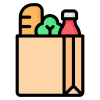

<p align="center">
  
</p>

<h1 align="center">Grocify</h1>
<p align="center">A modern, responsive online grocery website, built with React, Tailwind CSS, and GSAP for smooth animations and seamless user experience.</p>

<p align="center">
  <a href="https://react.dev/">
    
  </a>
  <a href="https://tailwindcss.com/">
    
  </a>
  <a href="https://gsap.com/">
    
  </a>
  <a href="https://opensource.org/licenses/MIT">
    
  </a>
  <a href="https://github.com/MohammadZakariya786/Grocify/stargazers">
    
  </a>
  <a href="https://github.com/MohammadZakariya786/Grocify/network/members">
    
  </a>
  <a href="https://github.com/MohammadZakariya786/Grocify/watchers">
    
  </a>
  <a href="https://github.com/MohammadZakariya786/Grocify/commits/main">
    
  </a>
</p>

---

## 🌟 Features
- 🥦 **Shop by Category:** Browse products by Fruits & Veggies, Dairy & Eggs, and Meat & Seafood.  
- 🛒 **Product Listings:** View detailed product cards with images, prices, and categories.  
- ✨ **Animated UI:** Smooth animations using GSAP for engaging transitions.  
- 📱 **Responsive Design:** Fully responsive layout using Tailwind CSS.  
- 🤖 **AI Chatbot Support:** Smart virtual assistant for customer queries, with efficient API usage and knowledge base integration.  
- 🗣️ **Customer Testimonials:** Swiper-based carousel for customer reviews.  
- 📧 **Contact Form:** Easy-to-use contact form for customer support.  
- 🎁 **First Order Discount:** Promotional banner for new customers.  

---

## 🛠️ Technologies Used
- ⚛️ **React.js** – Frontend framework  
- 🎨 **Tailwind CSS** – Utility-first CSS framework  
- 🎬 **GSAP** – Animation library  
- 🧭 **React Router** – Routing  
- 🔗 **React Icons** – Icon library  
- 🎠 **Swiper** – Carousel for testimonials  

---

## 🤖 AI Chatbot Design
The Grocify website features a custom AI chatbot designed for **efficiency, relevance, and cost-effectiveness**:

- 💬 **Predefined Q&A Matching:**  
  For common greetings and FAQs (like "hi", "how are you", "what is Grocify"), the chatbot instantly responds using a local set of predefined question-answer pairs.  
  This avoids unnecessary API calls and ensures fast responses.

- 📚 **Knowledge Base Integration:**  
  If the user's question does not match any predefined Q&A, the chatbot checks a curated knowledge base for Grocify-related topics.  
  If a relevant topic is found, the chatbot sends the user's question and the matched knowledge base context to the Gemini AI service to generate a context-aware answer.

- ⚡ **API Call Optimization:**  
  The chatbot only calls the Gemini AI API when a user's question is not covered by the predefined Q&A. This reduces API usage and helps avoid hitting rate limits.

- 🔄 **API Key Rotation:**  
  The system uses three API keys for Gemini AI. If one key reaches its usage limit, the chatbot automatically switches to the next available key, ensuring uninterrupted       service.

- 🚫 **Domain Restriction:**  
  If a user's question is unrelated to Grocify and does not match any predefined or knowledge base topics, the chatbot politely responds that it only answers questions        related to the Grocify website. 

> This approach balances **performance, cost, and user experience**, making the chatbot efficient and helpful.


---

## ⚡ Getting Started

### Prerequisites
- Node.js (v18 or higher recommended)  
- npm  

### Installation
1. Clone the repository:
   ```sh
   git clone https://github.com/yourusername/grocify-website.git
   cd grocify-website
   ```

2. Install dependencies:
   ```sh
   npm install
   ```

3. Create a `.env.local` file in the root directory and add your Gemini API keys:
   ```
   GEMINI_API_KEY_1=your_key_1
   GEMINI_API_KEY_2=your_key_2
   GEMINI_API_KEY_3=your_key_3
   ```

4. Start the development server:
   ```sh
   npm run dev
   ```

5. Open [http://localhost:5173](http://localhost:5173) in your browser.  

---

### Build for Production
```sh
npm run build
```

### Preview Production Build
```sh
npm run preview
```

---

## 📂 Project Structure
```
grocify-website/
  ├── api/                # Serverless API (Gemini integration)
  ├── public/             # Static assets
  ├── src/
  │   ├── assets/         # Images and media
  │   ├── components/     # React components (including Chatbot)
  │   ├── Page/           # Page-level components
  │   ├── App.jsx         # Main app entry
  │   ├── constant.js     # Project data/constants
  │   └── main.jsx        # React root
  ├── index.html
  ├── package.json
  └── vite.config.js
```

---

## 🚀 Deployment
This project is ready for deployment on [Vercel](https://vercel.com/) or any static hosting provider.  
The `vercel.json` file is included for custom routing.  

---

## 🙌 Credits
- Project by **Mohammad Zakariya**  
- Product images and icons from [Unsplash](https://unsplash.com/) and [React Icons](https://react-icons.github.io/react-icons/)  

---

## 📜 License
This project is licensed under the **MIT License**


---

If you like **Grocify**, give it a ⭐ on [GitHub](https://github.com/MohammadZakariya786/Grocify) and support the project!

